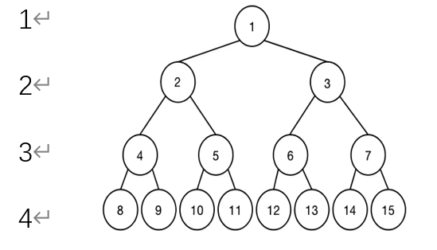
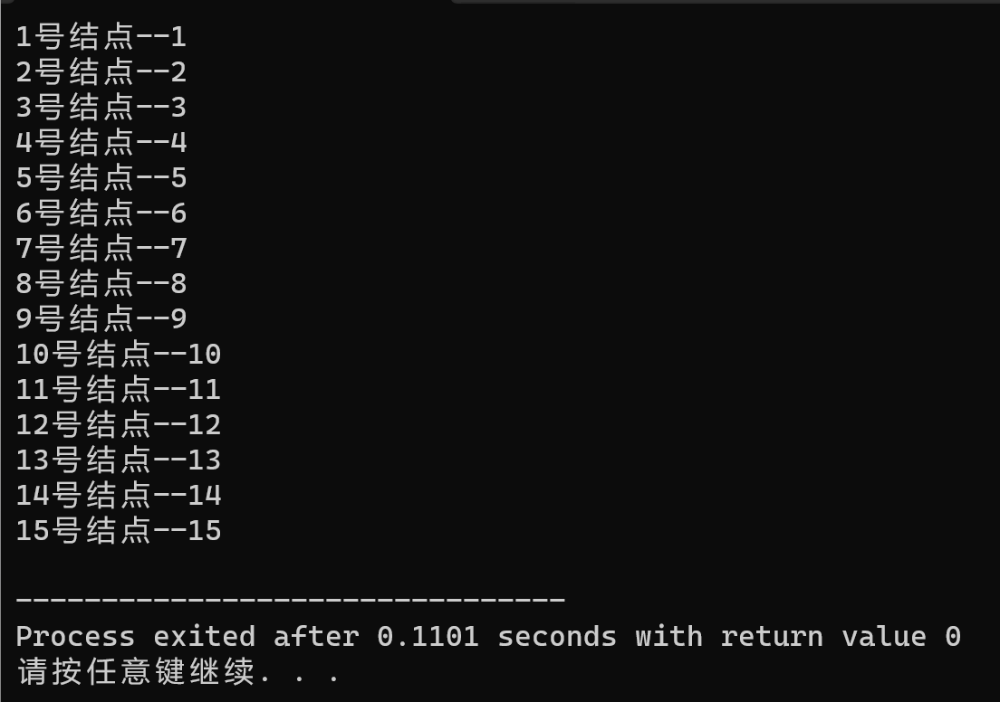

# C-TreeNodeNumberInBinary
二叉树节点序号的二进制表示法

## 结论说明
1. 详细实现过程请阅读[我的博客](https://zhuanlan.zhihu.com/p/23279147313)

2. 节点序号用二进制表示  
对于如图的一个满二叉树  
  
我们从根节点( 1号 )开始出发, 往左边走的操作记作"左", 用 0 表示, 右边记作"右", 用 1 表示  
`①第 2 层——2 号节点: 0 → 3 号节点: 1`    
`②第 3 层——4 号节点: 00 → 5 号节点: 01 → 6 号节点: 10 → 7 号节点: 11`    
`③第 4 层——8: 左左左000 → 9: 左左右001 → 10: 左右左010 → 11: 左右右011 → 12: 右左左100 → 13: 右左右101 → 14: 右右左110 → 15: 右右右111`  

4. [源码](https://github.com/existed-name/C-TreeNodeNumberInBinary/blob/main/TreeNodeNumberInBinary.c)核心函数
   1. [获取指定序号的节点](https://github.com/existed-name/C-TreeNodeNumberInBinary/blob/main/TreeNodeNumberInBinary.c#L182-L202)
   2. [获取节点所在层数](https://github.com/existed-name/C-TreeNodeNumberInBinary/blob/main/TreeNodeNumberInBinary.c#L108-L115)
   3. [获取节点的横向位置( 从左到右 ) ](https://github.com/existed-name/C-TreeNodeNumberInBinary/blob/main/TreeNodeNumberInBinary.c#L117-L121)
   4. [将横向位置转换为二进制数( 用数组储存每一位数字 ) ](https://github.com/existed-name/C-TreeNodeNumberInBinary/blob/main/TreeNodeNumberInBinary.c#L138-L140)

5. 源码运行结果
   15 个节点( 4 层 )的满二叉树, 依次访问各个序号对应的节点  
   

## 下载说明
1. 下载整个仓库: 仓库首页右上部分 → 绿色的 "<> Code" → Local → Download Zip
2. 只下载某一个文件
   进入该文件, 在代码框右上角
   * 选择 `Copy row file` 复制代码粘贴到编译器上
   * 或者 `Download row file` 下载文件
3. 下载特定文件夹:    
   1. 进入特定文件夹, 复制网址到 [DownGit](https://tool.mkblog.cn/downgit/#/home) 上进行下载    
   2. 在英文输入法下按 "," 或者 "." 键 → 进入 github.dev 线上 VScode → 在左边选择资源管理器 → 右键指定文件夹, 下载到电脑指定位置    
   3. 使用其他插件、网站    
4. 使用 Git 命令下载

## 其他仓库
* C 语言
  - [猜数游戏](https://github.com/existed-name/C-GuessNumber/tree/main)
  - [连珠棋游戏](https://github.com/existed-name/C-LianzhuChess)
  - [线性数据结构](https://github.com/existed-name/C-LinearDataStructre)
* Java
  - [健康计算器](https://github.com/existed-name/Java-Health-Calculator)
 
---

